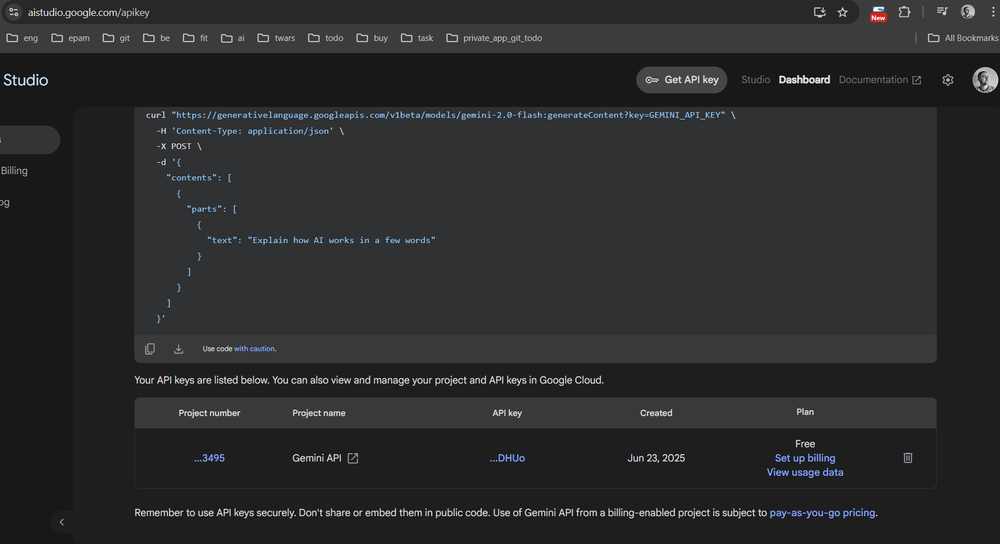
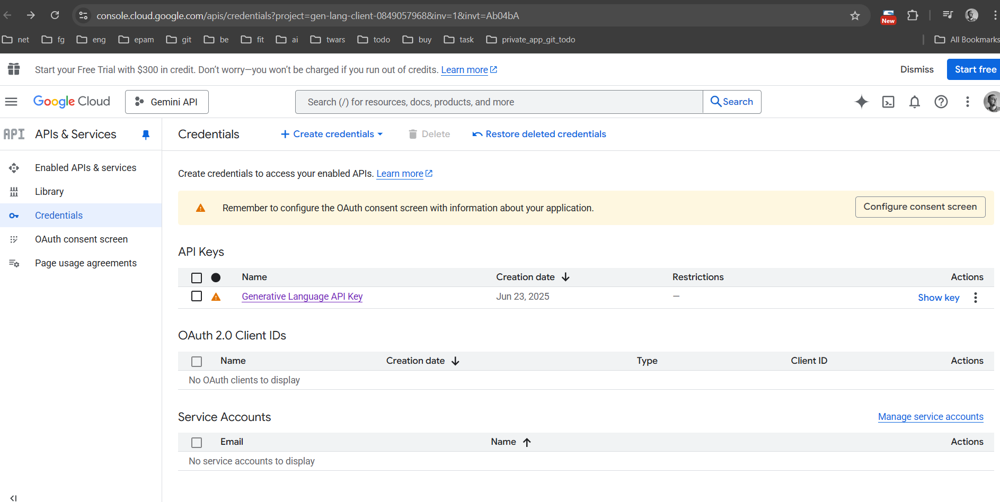
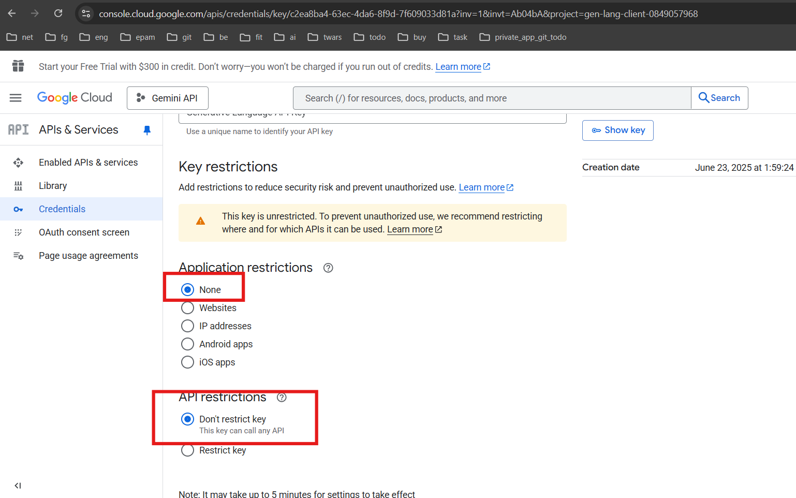

# Links:
* https://aistudio.google.com/prompts/new_chat
* https://console.cloud.google.com/apis/credentials?project=gen-lang-client-0849057968&inv=1&invt=Ab04bA
* https://ai.google.dev/gemini-api/docs/quickstart#java

### 1. Create new key for new project: https://aistudio.google.com/apikey  

 
***
curl "https://generativelanguage.googleapis.com/v1beta/models/gemini-2.0-flash:generateContent?key=GEMINI_API_KEY" \
-H 'Content-Type: application/json' \
-X POST \
-d '{
"contents": [
{
"parts": [
{
"text": "Explain how AI works in a few words"
}
]
}
]
}'
***

### 2. Configurate security: https://console.cloud.google.com/apis/credentials?project=gen-lang-client-0849057968&inv=1&invt=Ab04bA

and SAVE.